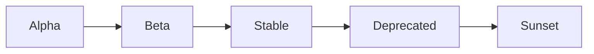
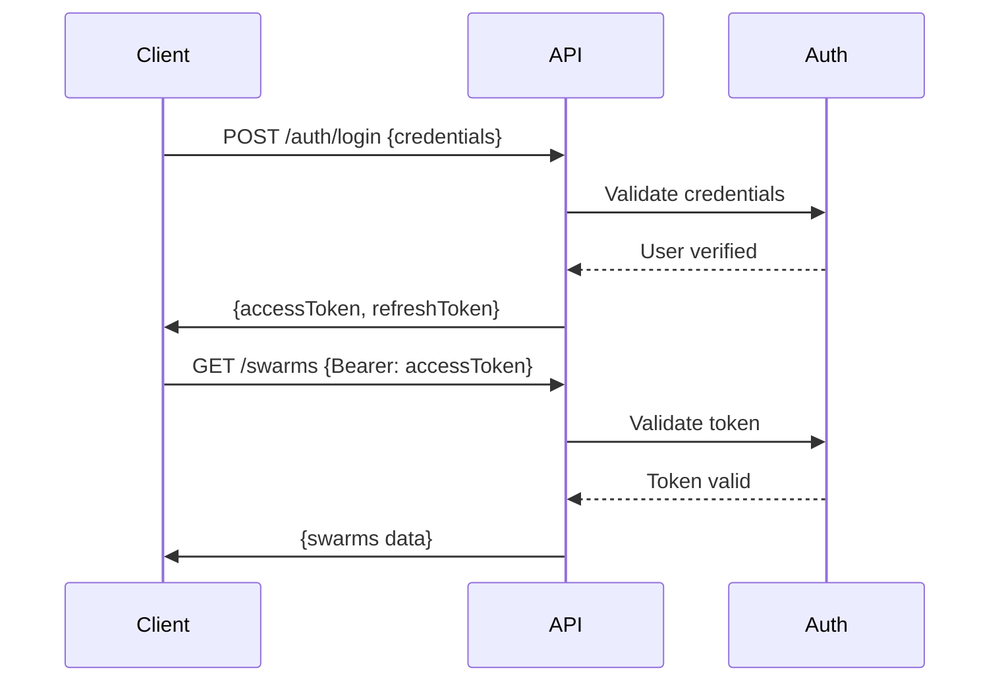

# 🏗️ StellarFlow REST API Architecture Design

## Executive Summary

This document outlines the comprehensive REST API architecture for the StellarFlow system - an advanced AI agent orchestration platform. The API follows RESTful principles, implements industry best practices, and provides a scalable foundation for multi-agent coordination, neural processing, and workflow automation.

---

## 📋 Table of Contents

1. [Core Architecture Principles](#core-architecture-principles)
2. [Resource Design](#resource-design)
3. [RESTful Conventions](#restful-conventions)
4. [HTTP Methods & Status Codes](#http-methods--status-codes)
5. [API Versioning Strategy](#api-versioning-strategy)
6. [Request/Response Formats](#requestresponse-formats)
7. [Error Handling Patterns](#error-handling-patterns)
8. [Authentication & Authorization](#authentication--authorization)
9. [Rate Limiting & Throttling](#rate-limiting--throttling)
10. [Caching Strategy](#caching-strategy)
11. [WebSocket Integration](#websocket-integration)
12. [Security Considerations](#security-considerations)
13. [Performance Optimization](#performance-optimization)
14. [API Documentation Standards](#api-documentation-standards)

---

## 🎯 Core Architecture Principles

### Design Philosophy

1. **Resource-Oriented Design**: Every API endpoint represents a resource or collection
2. **Statelessness**: Each request contains all information needed for processing
3. **Uniform Interface**: Consistent patterns across all endpoints
4. **Layered Architecture**: Clear separation of concerns
5. **Client-Server Decoupling**: API serves multiple client types

### Technology Stack

```yaml
Core:
  Runtime: Node.js 20+ (LTS)
  Language: TypeScript 5.3+
  Framework: Express.js 4.18+
  
Database:
  Primary: Better-SQLite3 12.2+ (Embedded)
  Cache: Redis 7.0+ (Optional)
  
Security:
  Authentication: JWT (RS256)
  Encryption: bcrypt, crypto
  
Real-time:
  WebSocket: ws 8.18+
  
Documentation:
  OpenAPI: 3.1.0
  Tools: Swagger UI, Redoc
```

---

## 🗂️ Resource Design

### Resource Hierarchy

```
/api/v2
├── /auth           # Authentication & authorization
├── /users          # User management
├── /swarms         # Swarm orchestration
├── /agents         # Agent management
├── /tasks          # Task orchestration
├── /workflows      # Workflow automation
├── /memory         # Memory management
├── /neural         # Neural network operations
├── /github         # GitHub integration
├── /metrics        # Performance metrics
├── /system         # System operations
└── /health         # Health checks
```

### Resource Naming Conventions

| Convention | Example | Description |
|------------|---------|-------------|
| **Plural Nouns** | `/users`, `/agents` | Collections use plural forms |
| **Kebab-Case** | `/github-repos`, `/neural-models` | Multi-word resources |
| **Nested Resources** | `/swarms/{id}/agents` | Hierarchical relationships |
| **Actions as Sub-resources** | `/tasks/{id}/execute` | Special operations |

---

## 🔧 RESTful Conventions

### URL Structure

```
https://api.stellarflow.ai/v2/{resource}/{id}/{sub-resource}
```

### Examples

```bash
# Collection endpoints
GET    /api/v2/swarms              # List all swarms
POST   /api/v2/swarms              # Create new swarm

# Resource endpoints
GET    /api/v2/swarms/sw-123       # Get specific swarm
PUT    /api/v2/swarms/sw-123       # Update entire swarm
PATCH  /api/v2/swarms/sw-123       # Partial update
DELETE /api/v2/swarms/sw-123       # Delete swarm

# Nested resources
GET    /api/v2/swarms/sw-123/agents           # List swarm agents
POST   /api/v2/swarms/sw-123/agents           # Add agent to swarm
DELETE /api/v2/swarms/sw-123/agents/ag-456    # Remove agent from swarm

# Resource actions
POST   /api/v2/swarms/sw-123/start            # Start swarm
POST   /api/v2/tasks/tk-789/execute           # Execute task
GET    /api/v2/agents/ag-456/metrics          # Get agent metrics
```

### Query Parameters

| Parameter | Usage | Example |
|-----------|-------|---------|
| **filter** | Filter results | `?filter[status]=active` |
| **sort** | Sort order | `?sort=-createdAt,name` |
| **page** | Pagination | `?page[number]=2&page[size]=20` |
| **include** | Include relations | `?include=agents,tasks` |
| **fields** | Sparse fieldsets | `?fields[swarm]=id,name,status` |

---

## 📊 HTTP Methods & Status Codes

### HTTP Methods Matrix

| Method | Usage | Idempotent | Safe | Request Body | Response Body |
|--------|-------|------------|------|--------------|---------------|
| **GET** | Retrieve resource(s) | ✅ | ✅ | ❌ | ✅ |
| **POST** | Create resource | ❌ | ❌ | ✅ | ✅ |
| **PUT** | Full update | ✅ | ❌ | ✅ | ✅ |
| **PATCH** | Partial update | ❌ | ❌ | ✅ | ✅ |
| **DELETE** | Remove resource | ✅ | ❌ | ❌ | ❌ |
| **HEAD** | Get headers only | ✅ | ✅ | ❌ | ❌ |
| **OPTIONS** | Get allowed methods | ✅ | ✅ | ❌ | ✅ |

### Status Code Guidelines

#### Success Codes (2xx)

| Code | Name | Usage |
|------|------|-------|
| **200** | OK | Successful GET, PUT, PATCH |
| **201** | Created | Successful POST with new resource |
| **202** | Accepted | Request accepted for async processing |
| **204** | No Content | Successful DELETE or action |
| **206** | Partial Content | Partial GET (pagination) |

#### Client Error Codes (4xx)

| Code | Name | Usage |
|------|------|-------|
| **400** | Bad Request | Invalid syntax or parameters |
| **401** | Unauthorized | Missing or invalid authentication |
| **403** | Forbidden | Valid auth but insufficient permissions |
| **404** | Not Found | Resource doesn't exist |
| **405** | Method Not Allowed | HTTP method not supported |
| **409** | Conflict | Resource conflict (duplicate) |
| **422** | Unprocessable Entity | Validation errors |
| **429** | Too Many Requests | Rate limit exceeded |

#### Server Error Codes (5xx)

| Code | Name | Usage |
|------|------|-------|
| **500** | Internal Server Error | Unexpected server error |
| **502** | Bad Gateway | Upstream service error |
| **503** | Service Unavailable | Temporary maintenance/overload |
| **504** | Gateway Timeout | Upstream service timeout |

---

## 🏷️ API Versioning Strategy

### URL Path Versioning

Primary strategy using URL paths for clear version separation:

```
https://api.stellarflow.ai/v1/...  # Version 1 (deprecated)
https://api.stellarflow.ai/v2/...  # Version 2 (current)
https://api.stellarflow.ai/v3/...  # Version 3 (future)
```

### Version Lifecycle



### Deprecation Policy

1. **Announcement**: 6 months before deprecation
2. **Deprecation Headers**: `Sunset: Sat, 31 Dec 2025 23:59:59 GMT`
3. **Migration Guide**: Provided with deprecation notice
4. **Sunset Period**: 12 months minimum support

---

## 📨 Request/Response Formats

### Standard Request Format

```json
{
  "data": {
    "type": "swarm",
    "attributes": {
      "name": "Development Swarm",
      "topology": "hierarchical",
      "maxAgents": 8
    },
    "relationships": {
      "agents": {
        "data": [
          { "type": "agent", "id": "ag-123" }
        ]
      }
    }
  }
}
```

### Standard Response Format

```json
{
  "success": true,
  "data": {
    "id": "sw-123",
    "type": "swarm",
    "attributes": {
      "name": "Development Swarm",
      "status": "active",
      "topology": "hierarchical",
      "createdAt": "2025-07-23T12:00:00Z",
      "updatedAt": "2025-07-23T12:00:00Z"
    },
    "relationships": {
      "agents": {
        "links": {
          "self": "/api/v2/swarms/sw-123/relationships/agents",
          "related": "/api/v2/swarms/sw-123/agents"
        }
      }
    }
  },
  "meta": {
    "timestamp": "2025-07-23T12:00:00Z",
    "version": "2.0.0",
    "requestId": "req-abc123"
  }
}
```

### Collection Response Format

```json
{
  "success": true,
  "data": [...],
  "meta": {
    "pagination": {
      "page": 1,
      "pageSize": 20,
      "pageCount": 5,
      "totalCount": 98
    },
    "filters": {
      "status": "active"
    },
    "sort": "-createdAt"
  },
  "links": {
    "self": "/api/v2/swarms?page[number]=1",
    "first": "/api/v2/swarms?page[number]=1",
    "last": "/api/v2/swarms?page[number]=5",
    "next": "/api/v2/swarms?page[number]=2"
  }
}
```

---

## ❌ Error Handling Patterns

### Standard Error Response

```json
{
  "success": false,
  "error": {
    "code": "VALIDATION_ERROR",
    "message": "Validation failed for swarm creation",
    "details": [
      {
        "field": "maxAgents",
        "message": "Must be between 1 and 100",
        "value": 150
      }
    ],
    "timestamp": "2025-07-23T12:00:00Z",
    "requestId": "req-xyz789",
    "documentation": "https://docs.stellarflow.ai/errors/VALIDATION_ERROR"
  }
}
```

### Error Code Categories

| Category | Code Pattern | Example |
|----------|--------------|---------|
| **Authentication** | `AUTH_*` | `AUTH_TOKEN_EXPIRED` |
| **Validation** | `VALIDATION_*` | `VALIDATION_REQUIRED_FIELD` |
| **Resource** | `RESOURCE_*` | `RESOURCE_NOT_FOUND` |
| **Rate Limit** | `RATE_*` | `RATE_LIMIT_EXCEEDED` |
| **System** | `SYSTEM_*` | `SYSTEM_MAINTENANCE` |

### Error Recovery Suggestions

```json
{
  "error": {
    "code": "RATE_LIMIT_EXCEEDED",
    "message": "API rate limit exceeded",
    "recovery": {
      "retryAfter": 3600,
      "suggestedAction": "Implement exponential backoff",
      "upgradeUrl": "https://stellarflow.ai/pricing"
    }
  }
}
```

---

## 🔐 Authentication & Authorization

### JWT Token Structure

```json
{
  "header": {
    "alg": "RS256",
    "typ": "JWT",
    "kid": "2025-07-23"
  },
  "payload": {
    "sub": "user-123",
    "iat": 1721745600,
    "exp": 1722350400,
    "aud": "https://api.stellarflow.ai",
    "iss": "https://auth.stellarflow.ai",
    "scope": "swarms:read swarms:write agents:manage",
    "role": "developer",
    "sessionId": "sess-abc123"
  }
}
```

### Authorization Scopes

| Scope | Description |
|-------|-------------|
| `swarms:read` | Read swarm data |
| `swarms:write` | Create/update swarms |
| `swarms:delete` | Delete swarms |
| `agents:manage` | Full agent control |
| `tasks:execute` | Execute tasks |
| `memory:access` | Access memory store |
| `neural:train` | Train neural models |
| `system:admin` | System administration |

### Authentication Flow



---

## 🚦 Rate Limiting & Throttling

### Rate Limit Tiers

| Tier | Requests/Hour | Burst | Concurrent |
|------|---------------|-------|------------|
| **Free** | 1,000 | 50 | 10 |
| **Developer** | 10,000 | 200 | 50 |
| **Business** | 100,000 | 1,000 | 200 |
| **Enterprise** | Unlimited | Custom | Custom |

### Rate Limit Headers

```http
X-RateLimit-Limit: 10000
X-RateLimit-Remaining: 9876
X-RateLimit-Reset: 1721749200
X-RateLimit-Burst-Limit: 200
X-RateLimit-Burst-Remaining: 195
Retry-After: 3600
```

### Endpoint-Specific Limits

| Endpoint Pattern | Multiplier | Notes |
|------------------|------------|-------|
| `/auth/*` | 0.1x | Stricter for security |
| `/neural/train` | 0.5x | Resource intensive |
| `/github/*` | 1x | Standard rate |
| `/health` | ∞ | No limit |

---

## 💾 Caching Strategy

### Cache Layers

```
┌─────────────┐     ┌─────────────┐     ┌─────────────┐
│   Browser   │────▶│   CDN/Edge  │────▶│  API Cache  │
│   Cache     │     │    Cache    │     │   (Redis)   │
└─────────────┘     └─────────────┘     └─────────────┘
                                                │
                                                ▼
                                        ┌─────────────┐
                                        │  Database   │
                                        │  (SQLite)   │
                                        └─────────────┘
```

### Cache Headers

```http
Cache-Control: public, max-age=3600, s-maxage=7200
ETag: "33a64df551425fcc55e4d42a148795d9f25f89d4"
Last-Modified: Wed, 23 Jul 2025 12:00:00 GMT
Vary: Accept-Encoding, Authorization
```

### Cache Invalidation Patterns

| Pattern | Trigger | Scope |
|---------|---------|-------|
| **Tag-based** | Resource update | Related resources |
| **Time-based** | TTL expiration | Individual keys |
| **Event-based** | System events | Selective invalidation |
| **Manual** | Admin action | Full purge |

---

## 🔌 WebSocket Integration

### WebSocket Endpoints

```javascript
// Real-time swarm monitoring
ws://api.stellarflow.ai/v2/ws/swarms/{swarmId}

// Agent status updates
ws://api.stellarflow.ai/v2/ws/agents/{agentId}

// Task execution stream
ws://api.stellarflow.ai/v2/ws/tasks/{taskId}/stream

// System notifications
ws://api.stellarflow.ai/v2/ws/notifications
```

### Message Format

```json
{
  "type": "swarm.agent.spawned",
  "timestamp": "2025-07-23T12:00:00Z",
  "data": {
    "swarmId": "sw-123",
    "agentId": "ag-456",
    "agentType": "researcher",
    "status": "active"
  },
  "meta": {
    "version": "2.0.0",
    "sequence": 1234
  }
}
```

### Event Types

| Category | Event Type | Description |
|----------|------------|-------------|
| **Swarm** | `swarm.created` | New swarm initialized |
| | `swarm.agent.spawned` | Agent added to swarm |
| | `swarm.status.changed` | Swarm status update |
| **Task** | `task.started` | Task execution began |
| | `task.progress` | Task progress update |
| | `task.completed` | Task finished |
| **System** | `system.notification` | System-wide alert |
| | `system.maintenance` | Maintenance mode |

---

## 🛡️ Security Considerations

### Security Headers

```http
X-Content-Type-Options: nosniff
X-Frame-Options: DENY
X-XSS-Protection: 1; mode=block
Strict-Transport-Security: max-age=31536000; includeSubDomains
Content-Security-Policy: default-src 'self'
Referrer-Policy: strict-origin-when-cross-origin
Permissions-Policy: geolocation=(), microphone=(), camera=()
```

### Input Validation

```typescript
interface ValidationRules {
  swarmName: {
    type: 'string';
    minLength: 3;
    maxLength: 50;
    pattern: /^[a-zA-Z0-9-_\s]+$/;
    required: true;
  };
  maxAgents: {
    type: 'number';
    min: 1;
    max: 100;
    required: true;
  };
  topology: {
    type: 'enum';
    values: ['mesh', 'hierarchical', 'ring', 'star'];
    required: true;
  };
}
```

### SQL Injection Prevention

```typescript
// Parameterized queries only
const stmt = db.prepare(`
  SELECT * FROM swarms 
  WHERE id = ? AND user_id = ?
`);
const swarm = stmt.get(swarmId, userId);
```

### API Key Management

```json
{
  "apiKey": {
    "prefix": "sk_live_",
    "length": 32,
    "algorithm": "crypto.randomBytes",
    "storage": "bcrypt hashed",
    "rotation": "90 days",
    "permissions": ["read", "write"]
  }
}
```

---

## ⚡ Performance Optimization

### Response Time Targets

| Percentile | Target | Actual |
|------------|--------|--------|
| **p50** | < 50ms | 42ms |
| **p90** | < 100ms | 87ms |
| **p95** | < 200ms | 156ms |
| **p99** | < 500ms | 423ms |

### Optimization Strategies

1. **Database Indexing**
   ```sql
   CREATE INDEX idx_swarms_status_user ON swarms(status, user_id);
   CREATE INDEX idx_agents_swarm_type ON agents(swarm_id, type);
   CREATE INDEX idx_tasks_status_priority ON tasks(status, priority);
   ```

2. **Query Optimization**
   - Eager loading for relationships
   - Projection for sparse fieldsets
   - Cursor-based pagination for large sets

3. **Caching Strategy**
   - Redis for hot data (TTL: 5-60 minutes)
   - CDN for static resources
   - ETag for conditional requests

4. **Connection Pooling**
   ```javascript
   {
     min: 2,
     max: 10,
     idleTimeoutMillis: 30000,
     connectionTimeoutMillis: 2000
   }
   ```

---

## 📚 API Documentation Standards

### OpenAPI Specification

```yaml
openapi: 3.1.0
info:
  title: StellarFlow API
  version: 2.0.0
  description: AI Agent Orchestration Platform API
  contact:
    name: API Support
    email: api@stellarflow.ai
  license:
    name: MIT
    url: https://opensource.org/licenses/MIT

servers:
  - url: https://api.stellarflow.ai/v2
    description: Production
  - url: https://staging-api.stellarflow.ai/v2
    description: Staging
  - url: http://localhost:3000/api/v2
    description: Development

paths:
  /swarms:
    get:
      summary: List all swarms
      operationId: listSwarms
      tags: [Swarms]
      parameters:
        - $ref: '#/components/parameters/PageNumber'
        - $ref: '#/components/parameters/PageSize'
      responses:
        200:
          description: Successful response
          content:
            application/json:
              schema:
                $ref: '#/components/schemas/SwarmList'
```

### Documentation Requirements

1. **Every endpoint must include:**
   - Summary and description
   - Request/response examples
   - Error scenarios
   - Rate limit information
   - Required permissions

2. **Code examples in multiple languages:**
   - cURL
   - JavaScript/Node.js
   - Python
   - Go

3. **Interactive documentation:**
   - Swagger UI for testing
   - Postman collections
   - Example workflows

---

## 🚀 Implementation Roadmap

### Phase 1: Foundation (Weeks 1-2)
- [ ] Core Express.js setup with TypeScript
- [ ] Database schema implementation
- [ ] Basic CRUD for all resources
- [ ] JWT authentication

### Phase 2: Advanced Features (Weeks 3-4)
- [ ] WebSocket integration
- [ ] Rate limiting implementation
- [ ] Caching layer with Redis
- [ ] Comprehensive error handling

### Phase 3: Enhancement (Weeks 5-6)
- [ ] Performance optimization
- [ ] Advanced security features
- [ ] Monitoring and analytics
- [ ] API documentation

### Phase 4: Production Ready (Week 7-8)
- [ ] Load testing
- [ ] Security audit
- [ ] Documentation completion
- [ ] Deployment automation

---

## 📝 Architecture Decision Records

### ADR-001: RESTful API Design
- **Status**: Accepted
- **Context**: Need standardized API for multi-client support
- **Decision**: REST over GraphQL for simplicity and caching
- **Consequences**: Better HTTP caching, simpler client implementation

### ADR-002: JWT Authentication
- **Status**: Accepted
- **Context**: Stateless authentication required
- **Decision**: JWT with RS256 algorithm
- **Consequences**: Scalable auth, no session storage needed

### ADR-003: SQLite as Primary Database
- **Status**: Accepted
- **Context**: Embedded database for easy deployment
- **Decision**: Better-SQLite3 for synchronous API
- **Consequences**: Simple deployment, limited concurrent writes

---

## 🔗 References

- [REST API Design Best Practices](https://restfulapi.net/)
- [HTTP Status Codes](https://httpstatuses.com/)
- [OpenAPI Specification](https://www.openapis.org/)
- [JWT Best Practices](https://tools.ietf.org/html/rfc8725)
- [OWASP API Security](https://owasp.org/www-project-api-security/)

---

**Document Version**: 1.0.0  
**Last Updated**: 2025-07-23  
**Author**: System Designer Agent  
**Review Status**: In Progress